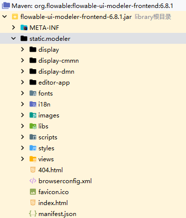

## 集成modeler
	解压并拷贝flowable-spring-boot-starter-ui-modeler/flowable-ui-modeler-frontend下的modeler文件夹到resources/static目录下

### 自定义API
url-config.js 

自定义：

	/workFlow/flowable/rest/editor-users?filter=xx
	/workFlow/flowable/rest/editor-groups?filter=xx

原始：

	modeler-app/rest/editor-users?filter=xx
	modeler-app/rest/editor-groups?filter=xx

### 活动国际化调整
en.json

	BPMN.STENCILS.RECEIVEEVENTTASK.TITLE->RECEIVEEVENTTASK->接收事件任务
	BPMN.STENCILS.EXTERNALWORKERTASK.TITLE->EXTERNALWORKERTASK->外部工作任务

zh-CN.json

	"RECEIVEEVENTTASK": {
		"TITLE": "事件接收任务",
		"DESCRIPTION": "An task that receives an event"
	},
	"EXTERNALWORKERTASK": {
		"TITLE": "外部工作任务",
		"DESCRIPTION": "An task that creates a job which can be executed by an external worker"
	},
